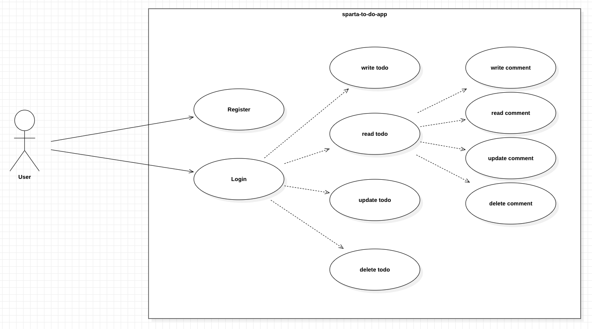
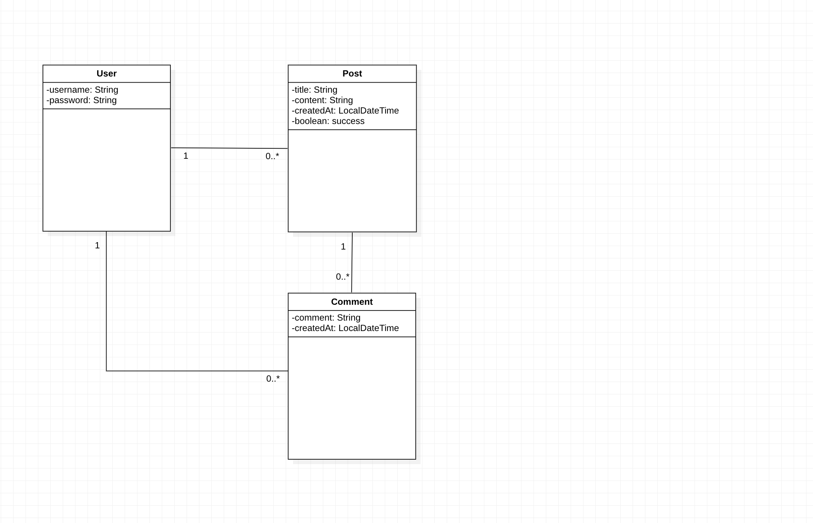

# Sparta TO-DO App Backend 
내일배움캠프 Spring 3기 7주차 개인과제 TO-DO App Backend

---

# Use-Case Diagram

 

# Functional Requirements
- ✅ 회원 가입
    - username, password를 Client에서 전달받기
    - username은  `최소 4자 이상, 10자 이하이며 알파벳 소문자(a~z), 숫자(0~9)`로 구성되어야 한다.
    - password는  `최소 8자 이상, 15자 이하이며 알파벳 대소문자(a~z, A~Z), 숫자(0~9)`로 구성되어야 한다.
    - DB에 중복된 username이 없다면 회원을 저장하고 Client 로 성공했다는 메시지, 상태코드 반환하기

- ✅ 로그인
    - username, password를 Client에서 전달받기
    - DB에서 username을 사용하여 저장된 회원의 유무를 확인하고 있다면 password 비교하기
    - 로그인 성공 시, 로그인에 성공한 유저의 정보와 JWT를 활용하여 토큰을 발급하고, 발급한 토큰을 Header에 추가하고 성공했다는 메시지, 상태코드 와 함께 Client에 반환하기

- ✅ 할일카드 작성 기능
    - 토큰을 검사하여, 유효한 토큰일 경우에만 할일 작성 가능
    - `할일 제목`,`할일 내용`, `작성일`을 저장할 수 있습니다. (~~작성자명, 비밀번호)~~
    - 할일 제목, 할일 내용을 저장하고
    - 저장된 할일을 Client 로 반환하기(username은 로그인 된 사용자)

- ✅ 할일카드  조회 기능
    - 선택한 할일 의 정보를 조회할 수 있습니다.
        - 반환 받은 할일 정보에는 `할일 제목`,`할일 내용`, `작성자` , `작성일`정보가 들어있습니다.

- ✅ 할일카드 목록 조회 기능
    - 등록된 할일 전체를 조회할 수 있습니다.
        - 회원별로 각각 나누어서 할일 목록이 조회됩니다.
        - 반환 받은 할일 정보에는 `할일 제목`, `작성자` , `작성일`, `완료 여부`정보가 들어있습니다.
    - 조회된 할일 목록은 `작성일` 기준 내림차순으로 정렬 되어있습니다.

- ✅ 할일카드 수정 기능
    - 선택한 할일카드의 `제목`, `작성 내용`을 수정할 수 있습니다.
        - 토큰을 검사한 후, 유효한 토큰이면서 해당 사용자가 작성한 게시글만 수정 가능
        - 할일 제목, 할일 내용을 수정하고 수정된 할일 정보는 Client 로 반환됩니다.
    - 수정된 할일의 정보를 반환 받아 확인할 수 있습니다.
        - 반환 받은 할일 정보에는 `할일 제목`,`할일 내용`, `작성자` , `작성일`정보가 들어있습니다.

- ✅ 할일카드 완료 기능
    - 토큰을 검사한 후, 유효한 토큰이면서 해당 사용자가 작성한 할일카드 만 완료 가능
    - 완료처리 한 할일카드는 목록조회시 `완료 여부`필드가 TRUE 로 내려갑니다.
    - `완료 여부` 기본값은 FALSE

- ✅ 댓글 작성
    - 토큰을 검사하여, 유효한 토큰일 경우에만 댓글 작성 가능
    - 선택한 할일의 DB 저장 유무를 확인하기
    - 선택한 할일이 있다면 댓글을 등록하고 등록된 댓글 반환하기

- ✅ 댓글 수정
    - 토큰을 검사한 후, 유효한 토큰이면서 해당 사용자가 작성한 댓글만 수정 가능
    - 선택한 댓글의 DB 저장 유무를 확인하기
    - 선택한 댓글이 있다면 댓글 수정하고 수정된 댓글 반환하기

- ✅ 댓글 삭제
    - 토큰을 검사한 후, 유효한 토큰이면서 해당 사용자가 작성한 댓글만 삭제 가능
    - 선택한 댓글의 DB 저장 유무를 확인하기
    - 선택한 댓글이 있다면 댓글 삭제하고 Client 로 성공했다는 메시지, 상태코드 반환하기

- ✅ 예외 처리 (ResponseEntity 사용)
    - 토큰이 필요한 API 요청에서 토큰을 전달하지 않았거나 정상 토큰이 아닐 때는 "토큰이 유효하지 않습니다." 라는 에러메시지와 statusCode: 400을 Client에 반환하기
    - 토큰이 있고, 유효한 토큰이지만 해당 사용자가 작성한 게시글/댓글이 아닌 경우에는 “작성자만 삭제/수정할 수 있습니다.”라는 에러메시지와 statusCode: 400을 Client에 반환하기
    - DB에 이미 존재하는 username으로 회원가입을 요청한 경우 "중복된 username 입니다." 라는 에러메시지와 statusCode: 400을 Client에 반환하기
    - 로그인 시, 전달된 username과 password 중 맞지 않는 정보가 있다면 "회원을 찾을 수 없습니다."라는 에러메시지와 statusCode: 400을 Client에 반환하기

 

# API Specification
| Domain  | Feature    |  Method  | URL                        | Request                                   |     | Response                                                                                                       | Exception                   | Description |
|:-------:|:-----------|:--------:|----------------------------|-------------------------------------------|:----|----------------------------------------------------------------------------------------------------------------|-----------------------------|-------------|
|  User   | 회원가입       |  `POST`  | /api/user/auth/register    | { username: String password: String } |     |                                                                                                                |                             |             |
|  User   | 로그인        |  `POST`  | /api/user/auth/login       | { username: String password: String } |     |                                                                                                                |                             |             |
|  Post   | 할일카드 작성    |  `POST`  | /api/post/                 | { title: String conetent: String }    |     | { username: String title: String conetent: String success: boolean createdAt: String }         |                             |             |
|  Post   | 할일카드 단일 조회 |  `GET`   | /api/post/{postId}         |                                           |     | { username: String title: String conetent: String success: boolean createdAt: String }         | POST_NOT_EXIST_EXCEPTION    |             |
|  Post   | 할일카드 목록 조회 |  `GET`   | /api/post/                 |                                           |     | {{ username: String posts: [ { postId: Long title: String success: boolean }, ... ]}, ...} |                             |             |
|  Post   | 할일카드 완료    |  `GET`   | /api/post/success/{postId} |                                           |     | true / false                                                                                                   | POST_NOT_EXIST_EXCEPTION    |             |
|  Post   | 할일카드 수정    |  `PUT`   | /api/post/{postId}         | { title: String conetent: String }    |     | { username: String title: String conetent: String success: boolean createdAt: String }         | POST_NOT_EXIST_EXCEPTION    |             |
|  Post   | 할일카드 삭제    | `DELETE` | /api/post/{postId}         |                                           |     | true / false                                                                                                   | POST_NOT_EXIST_EXCEPTION    |             |
| Comment | 댓글 작성      |  `POST`  | /api/comment{postId}       | { comment: String }                       |     | { username: String comment: String createdAt: String }                                                 |                             |             |
| Comment | 댓글 수정      | `UPDATE` | /api/comment/{commentId}   | { comment: String }                       |     | {username: String comment: String createdAt: String }                                                  | COMMENT_NOT_EXIST_EXCEPTION |             |
| Comment | 댓글 삭제      | `DELETE` | /api/comment/{commentId}   |                                           |     | true / false                                                                                                   | COMMENT_NOT_EXIST_EXCEPTION |             |

 

# Entity Relationship Diagram
